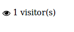

# pubnub-react-counter


Count how many people are present in one pubnub channel with React.

## Demo


## Usage
```jsx
import React from 'react';
import { render } from 'react-dom';
import PubNub from 'pubnub';

import Index from '../src/index';

const pubnub = new PubNub({
  publishKey: 'demo',
  subscribeKey: 'demo',
  ssl: true,
});

render(<p><Index channel="test-channel" pubnub={pubnub} /> visitor(s)</p>, document.getElementById('root'));
```


## Dev Mode
1. Clone this repository
1. Run `yarn install` (Usage of Yarn is recommended)
1. Edit the `src/index.jsx` file and then run `npm run dev`.  
1. This will start the `webpack-dev-server` 
1. Then open your browser at `localhost:3200`
1. The browser will be updated everytime you change the code at `src/index.jsx`

## Dev Features
* Linting with eslint
* Linting code style: Airbnb
* Testing with `jest@^21.2.1` and `enzyme@^3.1.1`
* Uses `babel` for JS transpiling
* Uses `webpack` for building the code

## Folder structure
* `/src`: The module code
* `/test`: The tests for the `src` components
* `/build`: The target compilation directory

## Credits
Juan Camilo Guarín Peñaranda  
[Otherwise SAS](https://github.com/owsas)  
Cali, Colombia, 2017

## License
MIT

## Support us on Patreon 
[](https://patreon.com/owsas)